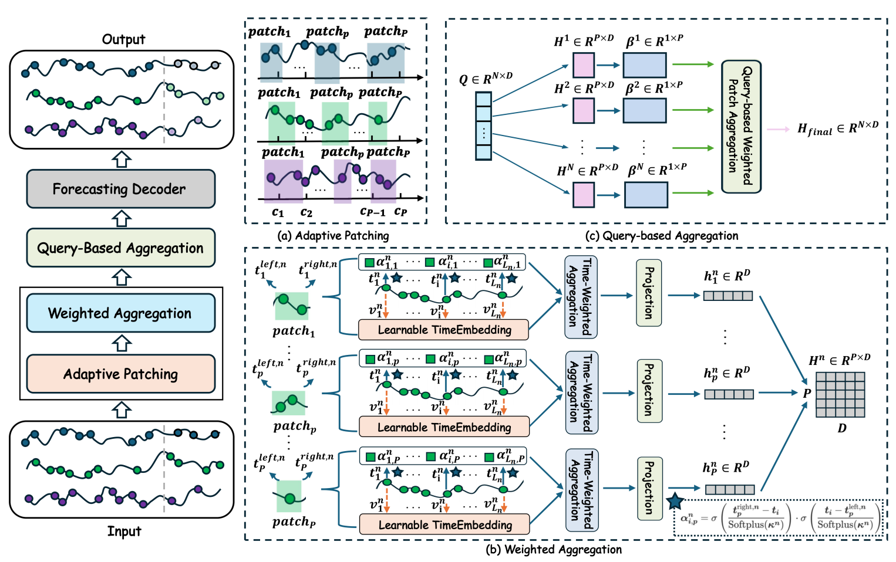
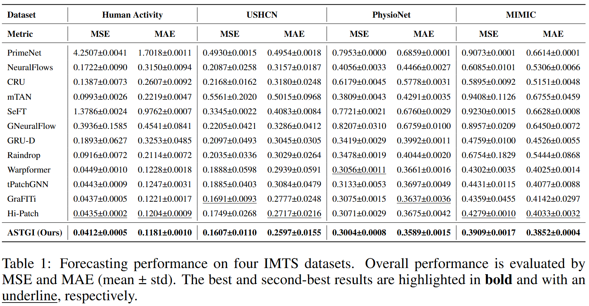

# ASTGI: Adaptive Spatio-Temporal Graph Interactions for Irregular Multivariate Time Series Forecasting 

[](https://www.python.org/downloads/release/python-3110/)
[](https://developer.nvidia.com/cuda-toolkit)
[](LICENSE)


## 🚀 Introduction
Irregular multivariate time series (IMTS) are prevalent in critical domains like healthcare and finance, where accurate forecasting is vital for proactive decision-making.  
However, the **asynchronous sampling** and **irregular intervals** inherent to IMTS pose two core challenges:

1. **Representation:** How to accurately represent the raw information of irregular time series without distortion.  
2. **Dependency Modeling:** How to effectively capture complex dynamic dependencies between observation points.

To address these challenges, we propose **ASTGI (Adaptive Spatio-Temporal Graph Interaction)** — a simple yet powerful framework:

- 🧩 **Point-wise Representation:** Encode each observation as a spatio-temporal point in a learnable embedding space.  
- 🔗 **Neighborhood-Adaptive Graph Construction:** Dynamically build causal graphs via nearest neighbor search.  
- 🔄 **Dynamic Propagation:** Iteratively update node features through spatio-temporal message passing.  
- 🎯 **Query-based Prediction:** Aggregate neighbors to forecast the value at a new query point.

<div align="center">

</div>

## 📦 Quickstart

**Recommended Environment**
- Python **3.11**
- CUDA **12.0**

### 1️⃣ Installation
Create a clean environment and install dependencies:
```bash
conda create -n astgi python=3.11 -y
conda activate astgi
pip install -r requirements.txt
```

### 2️⃣ Data Preparation

The **PhysioNet**, **USHCN**, and **Human Activity** datasets are downloaded and processed automatically when you run the code for the first time.

For the **MIMIC** dataset, a manual preprocessing step is required:

1.  Follow the preprocessing scripts in gru\_ode\_bayes to generate the `complete_tensor.csv` file.
2.  Place the generated file under the following path (you may need to create the directories):
    ```bash
    ~/.tsdm/rawdata/MIMIC_III_DeBrouwer2019/complete_tensor.csv
    ```

### 3️⃣ Train 

Run the benchmark experiments with provided scripts:

```bash
bash ./scripts/ASTGI/USHCN.sh
```

## 📊 Benchmark Results
<div align="center">

</div>

> 📈 **ASTGI consistently outperforms SOTA baselines** across multiple datasets.


## 🤝 Contributing

Contributions are welcome!
Feel free to open issues or submit pull requests if you find bugs or want to add new features.
