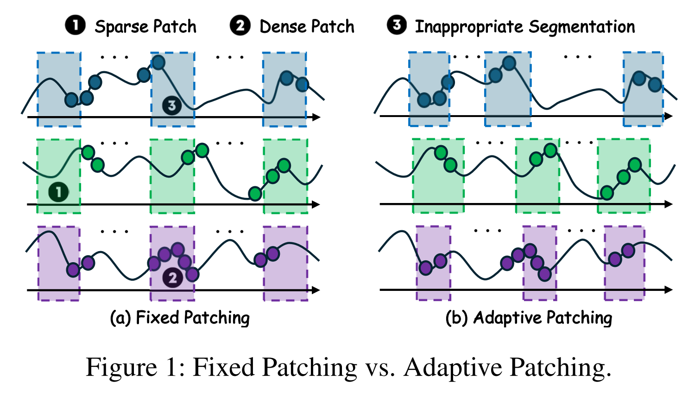
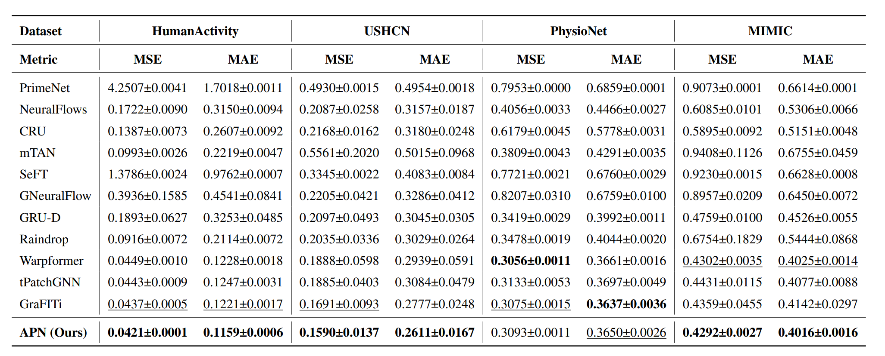
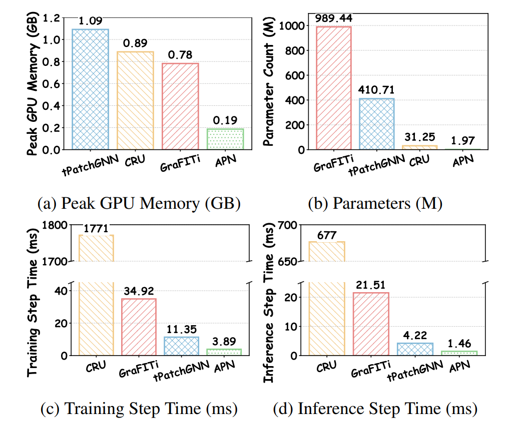
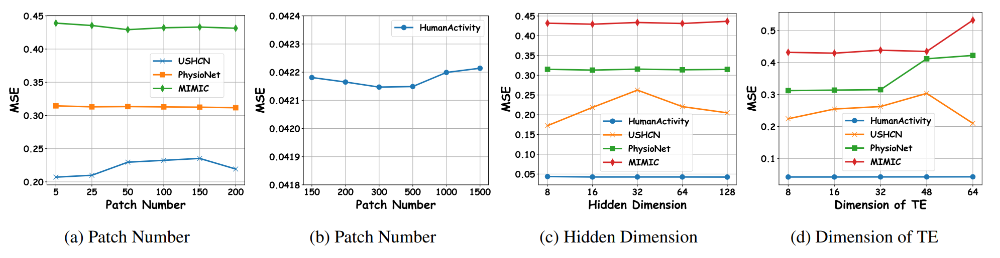

# APN: Rethinking Irregular Time Series Forecasting

[](https://arxiv.org/abs/2505.11250)  [](https://www.python.org/)  [](https://pytorch.org/)  

This code is the official PyTorch implementation of our AAAI'26 paper: [APN](https://arxiv.org/abs/2505.11250): Rethinking Irregular Time Series Forecasting: A Simple yet Effective Baseline.

If you find this project helpful, please don't forget to give it a ⭐ Star to show your support. Thank you!

🚩 News (2025.12) APN has been accepted by **AAAI 2026**.

## Introduction

**APN** (Adaptive Patching Network), which introduces a novel <ins>**A**</ins>daptive <ins>**P**</ins>atching paradigm to rethink irregular multivariate time series forecasting. Specifically, it designs a **Time-Aware Patch Aggregation (TAPA)** module that learns dynamically adjustable patch boundaries and employs a time-aware weighted averaging strategy. This transforms irregular sequences into high-quality, regularized representations in a channel-independent manner. Equipped with a simple query module and a shallow MLP, APN effectively integrates historical information while maintaining high efficiency.

<div align="center">

</div>

The comparisons between Fixed Patching and our Adaptive Patching: (a) Fixed Patching vs. (b) Adaptive Patching.
<div align="center">

</div>


## Quickstart

> [!IMPORTANT]
> This project is fully tested under Python 3.11.13. It is recommended that you set the Python version to 3.11.13.

### 1. Requirements

Given a python environment (**note**: this project is fully tested under python 3.11.13 and PyTorch 2.6.0+cu124), install the dependencies with the following command:

```shell
pip install -r requirements.txt
```

### 2. Data Preparation

Our model is evaluated on four widely used irregular time series datasets: **PhysioNet**, **MIMIC**, **HumanActivity**, and **USHCN**. The data preparation process differs slightly depending on the dataset's access restrictions.

#### 2.1 Public Datasets (Auto-Download)
For **HumanActivity**, **PhysioNet ('12)**, and **USHCN**, you generally do not need to prepare the data manually. Our code allows for automatic downloading and preprocessing upon the first run.

- **HumanActivity**: The script will automatically download and process the data. The processed files will be stored in:
  ```
  ./storage/datasets/HumanActivity
  ```
- **PhysioNet & USHCN**: These datasets are managed via the `tsdm` library. They will be automatically downloaded and cached in your home directory:
  ```
  ~/.tsdm/datasets/  # Processed data
  ~/.tsdm/rawdata/   # Raw data
  ```

#### 2.2 MIMIC Dataset
Due to privacy regulations, the **MIMIC** dataset requires credentialed access. Please follow the steps below to prepare it manually:

1.  **Request Access**: Obtain the raw data from [MIMIC](https://physionet.org/content/mimiciii/1.4/). You do not need to extract the `.csv.gz` files.
2.  **Preprocessing**: We adopt the standard preprocessing pipeline from **gru_ode_bayes**.
    - Clone the [gru_ode_bayes](https://github.com/edebrouwer/gru_ode_bayes/tree/master/data_preproc/MIMIC) repository.
    - Follow their instructions to generate the `complete_tensor.csv` file.
3.  **File Placement**: Move the generated `complete_tensor.csv` to the specific path expected by our dataloader (create folders if they don't exist):

```bash
mkdir -p ~/.tsdm/rawdata/MIMIC_III_DeBrouwer2019/
mv /path/to/your/complete_tensor.csv ~/.tsdm/rawdata/MIMIC_III_DeBrouwer2019/
```

Once the file is in place, our code will handle the final formatting (generating `.parquet` files) automatically during the first training session.

### 3. Train and evaluate model

- To see the model structure of APN, [click here](./models/APN.py).
- We provide all the experiment scripts for APN and other baselines under the folder `./scripts`. For example you can reproduce the experiment results on the USHCN dataset as the following script:

```shell
sh ./scripts/APN/P12.sh
```

## Results

### Main Results
Extensive experiments on 4 real-world datasets (PhysioNet, MIMIC, HumanActivity, USHCN) demonstrate that APN outperforms existing state-of-the-art (SOTA) methods such as GraFITi and tPatchGNN in both MSE and MAE metrics.

<div align="center">

</div>

### Efficiency Analysis
Comparison of computational efficiency on the USHCN dataset. APN exhibits significant advantages in **Peak GPU Memory**, **Parameters**, **Training Time**, and **Inference Time**.

<div align="center">

</div>

### Parameter Sensitivity
Results of parameter sensitivity analysis on the number of patches ($P$), hidden dimension ($D$), and time encoding dimension ($D_{te}$).

<div align="center">

</div>

## Citation

If you find this repo useful, please cite our paper.

```bibtex
@inproceedings{liu2026apn,
 title     = {Rethinking Irregular Time Series Forecasting: A Simple yet Effective Baseline},
 author    = {Xvyuan Liu and Xiangfei Qiu and Xingjian Wu and Zhengyu Li and Chenjuan Guo and Jilin Hu and Bin Yang},
 booktitle = {AAAI},
 year      = {2026}
}
```

## Acknowledgement

This work was partially supported by the National Natural Science Foundation of China (No.62472174) and the Fundamental Research Funds for the Central Universities.

## Contact

If you have any questions or suggestions, feel free to contact:

- Xvyuan Liu (xvyuanliu@stu.ecnu.edu.cn)
- [Xiangfei Qiu](https://qiu69.github.io/) (xfqiu@stu.ecnu.edu.cn)
- Xingjian Wu (xjwu@stu.ecnu.edu.cn)

Or describe it in Issues.
